# Estructura del proyecto Calendario

Este documento representa la organización funcional del proyecto y de sus archivos.

```mermaid
flowchart TD
    ROOT["📁 Calendario<br/>Repositorio Git"]

    ROOT --> APP["📁 app<br/>Aplicación web"]
    APP --> PREVIEW["📁 _sites-preview"]
    APP --> APPFILES["📄 page.tsx · layout.tsx<br/>globals.css · chatgpt-auth.ts"]

    ROOT --> LOCAL["🌐 Aplicación local"]
    LOCAL --> HTML["📄 index.html<br/>Interfaz principal"]
    LOCAL --> OPEN["📄 Abrir_Aplicacion.cmd<br/>Acceso directo"]
    LOCAL --> SERVER["📄 Servidor_Aplicacion.ps1<br/>Servidor y apertura de documentos"]
    LOCAL --> SECURITY["🔐 Seguridad_Acceso.ps1<br/>Usuario, contraseña y sesión local"]

    ROOT --> ARCHIVE["📁 archivo<br/>Documentos históricos"]
    ARCHIVE --> YEARS["📁 AAAA<br/>Una carpeta por año"]
    YEARS --> ANNUAL["📁 calendarios_anuales<br/>Archivos privados ignorados por Git"]
    YEARS --> MONTHLY["📁 registros_mensuales<br/>Archivos privados ignorados por Git"]

    ROOT --> DATA["📁 datos"]
    DATA --> PROCESSED["📁 procesados"]
    PROCESSED --> SEMANTICS["📄 calendar_semantics.json"]
    PROCESSED --> HOURS["📄 hours_data.json"]
    PROCESSED --> ENRICHED["📄 hours_enriched.json"]
    DATA --> SAVEINFO["📄 IMPORTANTE_GUARDADO.txt"]

    ROOT --> JSDATA["📊 Datos de la aplicación"]
    JSDATA --> HISTORICAL["📄 historical-data.js"]
    JSDATA --> SUMMARY["📄 authoritative-summary.js"]
    JSDATA --> MANIFEST["📄 archive-manifest.js"]

    ROOT --> TEMPLATE["📁 plantillas"]
    TEMPLATE --> ODS["📄 xxxxxxxxxxx.ods<br/>Modelo de documentos nuevos"]

    ROOT --> DOCS["📁 documentacion"]
    DOCS --> REPORT["📄 Informe explicativo.docx"]
    DOCS --> EXCEL["📄 Resumen calendario.xlsx"]

    ROOT --> ASSETS["📁 assets"]
    ASSETS --> WALLPAPER["🖼️ desktop-wallpaper.jpg"]

    ROOT --> GENERATORS["🛠️ Generadores de datos"]
    GENERATORS --> PY1["📄 make_archive_manifest.py"]
    GENERATORS --> PY2["📄 make_authoritative_summary.py"]
    GENERATORS --> PY3["📄 make_historical_js.py"]

    ROOT --> DATABASE["📁 db"]
    DATABASE --> DBFILES["📄 index.ts · schema.ts"]
    ROOT --> DRIZZLE["📁 drizzle<br/>Metadatos de base de datos"]
    ROOT --> WORKER["📁 worker<br/>index.ts"]
    ROOT --> TESTS["📁 tests<br/>rendered-html.test.mjs"]
    ROOT --> PUBLIC["📁 public<br/>Iconos SVG"]
    ROOT --> EXAMPLES["📁 examples<br/>Ejemplos técnicos"]

    ROOT --> CONFIG["⚙️ Configuración"]
    CONFIG --> PACKAGE["📄 package.json · package-lock.json"]
    CONFIG --> TYPESCRIPT["📄 tsconfig.json · next-env.d.ts"]
    CONFIG --> BUILD["📄 next.config.ts · vite.config.ts"]
    CONFIG --> STYLE["📄 postcss.config.mjs · eslint.config.mjs"]
    CONFIG --> DBCONFIG["📄 drizzle.config.ts"]
    CONFIG --> HOSTING["📁 .openai<br/>hosting.json"]
    CONFIG --> GITIGNORE["📄 .gitignore"]

    ROOT --> INFO["📚 Información"]
    INFO --> README["📄 README.md"]
    INFO --> LEEME["📄 LEEME.txt"]
    INFO --> PRIVACY["📄 PRIVACIDAD.md<br/>Protección de datos"]

    classDef main fill:#d8efff,stroke:#1976a3,color:#073954
    classDef archive fill:#e8f5e9,stroke:#388e3c,color:#174d1a
    classDef data fill:#fff3cd,stroke:#c58a00,color:#594000
    classDef config fill:#eeeeee,stroke:#616161,color:#212121
    classDef template fill:#e9ddff,stroke:#7652a5,color:#321d52

    class ROOT,APP,LOCAL,HTML,OPEN,SERVER main
    class ARCHIVE,YEARS,ANNUAL,MONTHLY archive
    class DATA,PROCESSED,JSDATA,HISTORICAL,SUMMARY,MANIFEST data
    class CONFIG,PACKAGE,TYPESCRIPT,BUILD,STYLE,DBCONFIG,HOSTING,GITIGNORE config
    class TEMPLATE,ODS template
```

## Resumen del contenido

- Calendarios anuales privados, conservados únicamente en el equipo local.
- Registros mensuales privados, conservados únicamente en el equipo local.
- Plantilla ODS utilizada para crear documentos mensuales nuevos.
- Datos históricos y resultados procesados utilizados por la aplicación.
- Informe explicativo y resumen general en formato Excel.
- Aplicación HTML local, servidor PowerShell y acceso directo de inicio.

## Carpetas principales

| Carpeta | Finalidad |
|---|---|
| `archivo` | Calendarios anuales y registros mensuales originales organizados por año. |
| `datos` | Datos procesados y recomendaciones para guardar copias. |
| `plantillas` | Plantilla ODS de referencia para crear documentos nuevos. |
| `documentacion` | Informe explicativo y hoja resumen de los cálculos. |
| `assets` | Fondo y recursos gráficos de la aplicación. |
| `app` | Componentes de la versión web del proyecto. |
| `db` y `drizzle` | Definición y metadatos de la base de datos. |
| `tests` | Pruebas automatizadas del entorno web. |
